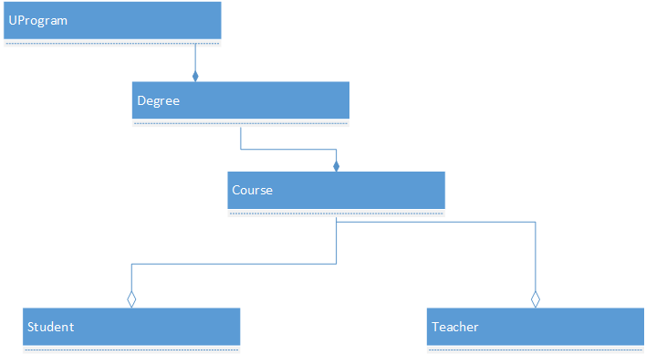

# edX DEV210.2x LAB 2

## Lab Requirements

In this assignment, you need to create a class file for:

* A Student
* A Teacher
* A Course

The Course object should contain an array of Student objects so ensure that you create an array inside 
the Course object to hold Students. 
A Course object will also contain a single Teacher object..  
For this assignment, create an array of size 3 for students.

Use this diagram as an example of how some objects relate to each other in a program that might be used to 
maintain class registrations.  The term UProgram is used so as not to confuse Program with a computer program.
It is meant to represent a program such as Computer Science or Liberal Arts, etc.

Class diagram showing the Program, Degree, Course, Student, and Teacher classes in a hiearchy where a Program 
is at the top, and contains Degrees which in turn contain Courses, which include students and teachers.

The Student and Teacher classes need to have private member variables for first and last names, age, address, 
city, and phone along with public accessors for these.

Each class needs to have a default constructor and one that sets the values of the member variables when the 
object is created.  Each class should also have a destructor.

Ensure that you are using a header (.h) and an implementation file (.cpp) for each class.

The Teacher class needs to have a method called GradeStudent() that accepts no arguments and returns nothing.
Have this method output an appropriate message to the console such as "Student graded".

Add a method to both Student and Teacher called SitInClass().  it should take no arguments and return no 
arguments but, to illustrate class scope, have the method output, "Sitting at front of class" for the teacher and 
"Sitting in main theater" for the students.

In the main() method:

1. Instantiate three Student objects called Student1, Student2, and Student3, provide values for the member variables.
2. Instantiate a Course object called **Intermediate C++**.
3. Add your three students to this Course object.
4. Instantiate at least one Teacher object.
5. Add that Teacher object to your Course object
6. Using cout statements where appropriate, follow these instructions:

    1. Output the name of the course
    2. Call the GradeStudent() method on the Teacher object
    3. Leave your application open and answer the Lab assessment questions
